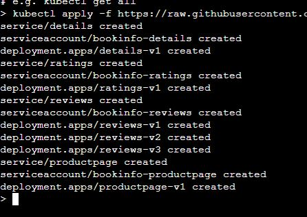
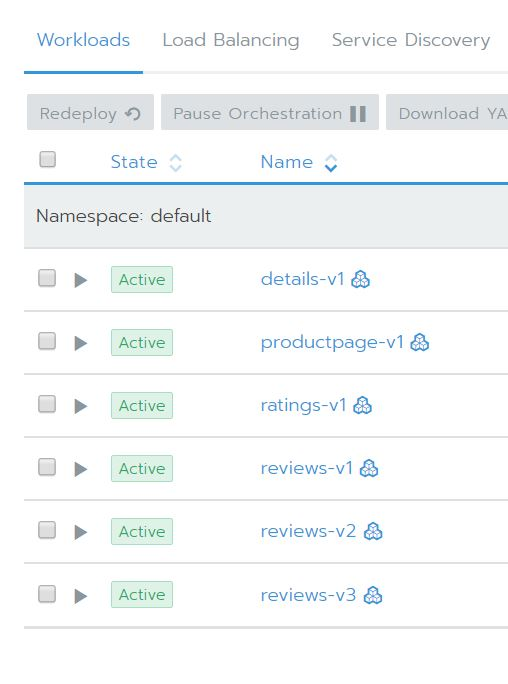
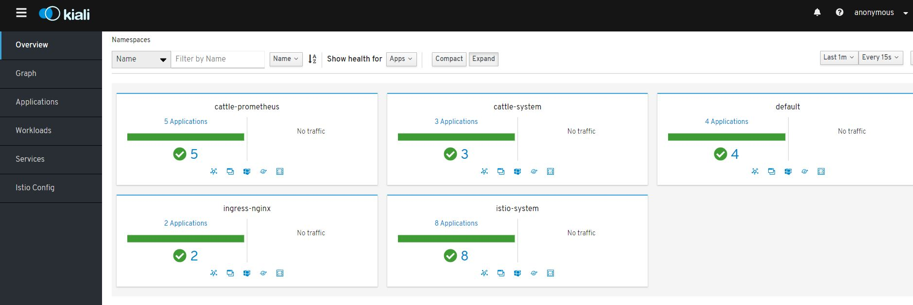

### Demonstration of the Istio Guestbook sample application on Rancher

The following instructions will give a walkthrough of installing Istio onto a Rancher 2.3 or later cluster.
The configuration described in the following is to demonstrate the feature and is not necessarily the config that should be used for a production environment.

There is an assumption made that readers are familiar with Rancher and Kubernetes.

## Environment
In order to test this you are going to need a Rancher Server with a child cluster.
For the child I would recommend a minimum of 3 nodes with 4x cpu and 8GB RAM 

## Install Istio
In order to enable Istio make sure that you have a cluster available with the minimum resources as defined in https://rancher.com/docs/rancher/v2.x/en/cluster-admin/tools/istio/
Enabling Istio will also enable the integrated Prometheus monitoring solution with further information on it's requirements found at https://rancher.com/docs/rancher/v2.x/en/project-admin/tools/monitoring/

Within the UI navigate to the child cluster and choose the `Tools > Istio` option

Scroll down to and expand the `Ingress Gateway` section, set `Enable Ingress Gateway` to `True` and `Service Type of Ingress Gateway` to `NodePort`.
By default Prometheus monitoring will be installed if it's not already enabled.
Click the Enable button at the bottom of the page and then allow it to install this may take a little while.

## Deploying an application

By default the automatic sidecar injection for istio is disabled. We are going to deploy to the default namespace so either from within the UI or from your computer you need to run `kubectl label namespace default istio-injection=enabled` against the child cluster.

We are going to use the Istio provided BookInfo application for this example, more information on it can be found at https://istio.io/docs/examples/bookinfo/

The following command needs to be executed against the cluster `kubectl apply -f https://raw.githubusercontent.com/istio/istio/release-1.3/samples/bookinfo/platform/kube/bookinfo.yaml`

You should see something similar to 

Going into the Default project on the child cluster should now show that there are some deployed services

Clicking on the Resource menu and choosing Istio

At this point you will see a message that states that there is `Not enough data for graph` which is to be expected as we aren't sending any traffic through to the application yet.

On the top right you will see

In order these are:
* Kiali - This shows you what services are in your mesh and how they are connected.
* Jaeger - Is used for monitoring and troubleshooting microservices-based distributed systems.
* Grafana - This lets you visualize data from Prometheus.
* Prometheus - A toolkit for systems monitoring and alerting.

Click on the Kiali button will present you with the Kiali dashboard looking something like

If you click on the Graph tab on the left and click the show unused nodes this will present you with a graph of the components of the application.

## Enabling the Istio Gateway

