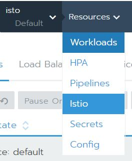
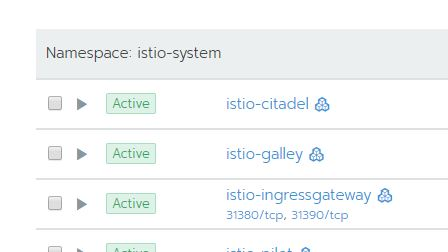
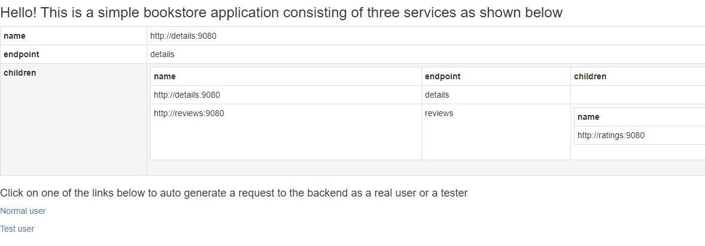
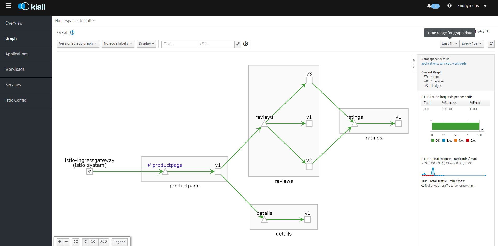
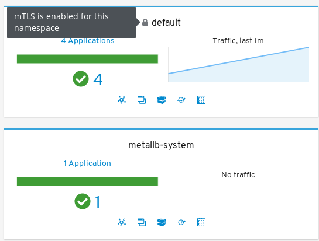
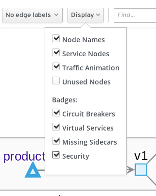
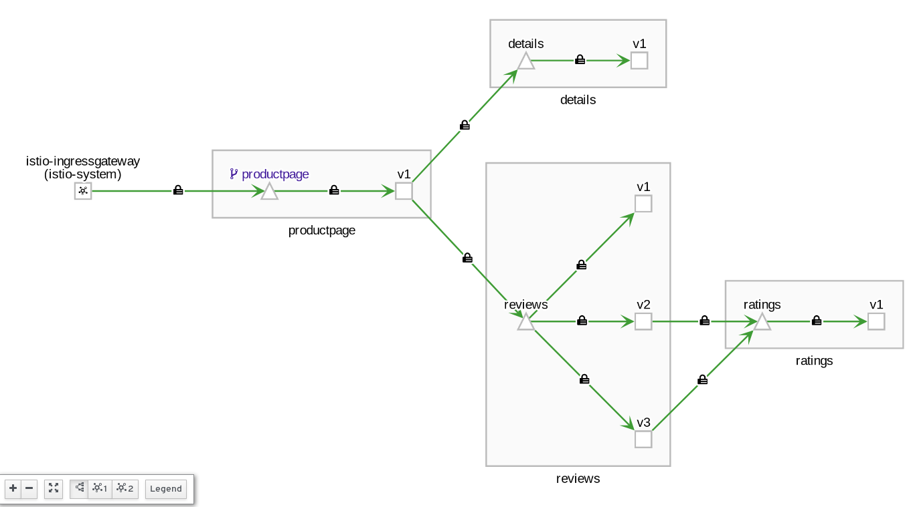

### Demonstration of the Istio Bookinfo sample application on Rancher

The following instructions will give a walkthrough of installing Istio onto a Rancher 2.3 or later cluster.
The configuration described in the following is to demonstrate the feature and is not necessarily the config that should be used for a production environment.

There is an assumption made that readers are familiar with Rancher and Kubernetes.

## Environment
In order to test this you are going to need a Rancher Server with a child cluster.
For the child I would recommend a minimum of 3 nodes with 4x cpu and 8GB RAM 

## Install Istio
In order to enable Istio make sure that you have a cluster available with the minimum resources as defined in https://rancher.com/docs/rancher/v2.x/en/cluster-admin/tools/istio/
Enabling Istio will also enable the integrated Prometheus monitoring solution with further information on it's requirements found at https://rancher.com/docs/rancher/v2.x/en/project-admin/tools/monitoring/

Within the UI navigate to the child cluster and choose the `Tools > Istio` option


Scroll down to and expand the `Ingress Gateway` section, set `Enable Ingress Gateway` to `True` and `Service Type of Ingress Gateway` to `NodePort`.
By default Prometheus monitoring will be installed if it's not already enabled.
Click the Enable button at the bottom of the page and then allow it to install this may take a little while.

## Deploying an application

By default the automatic sidecar injection for istio is disabled. We are going to deploy to the default namespace so either from within the UI or from your computer you need to run 

`kubectl label namespace default istio-injection=enabled` 

against the child cluster.

We are going to use the Istio provided BookInfo application for this example, more information on it can be found at https://istio.io/docs/examples/bookinfo/

The following command needs to be executed against the cluster 

`kubectl apply -f https://raw.githubusercontent.com/istio/istio/release-1.3/samples/bookinfo/platform/kube/bookinfo.yaml`

You should see something similar to


Going into the Default project on the child cluster should now show that there are some deployed services


Now clicking on the Resource menu and choose Istio



At this point you will see a message that states that there is `Not enough data for graph` which is to be expected as we aren't sending any traffic through to the application yet.

On the top right you will see


In order these are:
* Kiali - This shows you what services are in your mesh and how they are connected.
* Jaeger - Is used for monitoring and troubleshooting microservices-based distributed systems.
* Grafana - This lets you visualize data from Prometheus.
* Prometheus - A toolkit for systems monitoring and alerting.

Click on the Kiali button will present you with the Kiali dashboard looking something like


If you click on the Graph tab on the left and click the show unused nodes this will present you with a graph of the components of the application.

## Enabling the Istio Gateway

There are 2 things left to do in order for any traffic that we send to the server to be routed through to the application container.

First we need to define an ingress gateway, do this by executing the following command
`kubectl apply -f https://raw.githubusercontent.com/chrisurwin/rancher-istio/master/istio-gateway.yaml`

Secondly we need to set up the virtual service, do this by executing the following command
`kubectl apply -f https://raw.githubusercontent.com/chrisurwin/rancher-istio/master/istio-bookinfo-vs.yaml`

## Hitting the application

If you browse in the UI to the `System` project of the child cluster and find the `istio-system` namespace, you should see the following



Assuming you left the nodeport values as the defaults when enabling Istio, clicking on the `31380/tcp` should now launch you into the bookinfo app



Clicking on normal user will then take you to the sample page.

## Visualising the traffic

Kiali can now be revisited and should look a little more interesting, you may need to change the time range but you should now see something similar to



It is now possible to click in to the various traffic flows and get more insight into the traffic flows.

## Next steps

If you want to see some of the more advanced scenarios that can be performed with Istio I'd recommend visiting https://istio.io/docs/examples/bookinfo/

# Optional exercise - mTLS

Continuing on from implementing the Bookinfo application, the following steps demonstrate how we can secure the associated microservices by leveraging mutual TLS (mTLS)

## Prerequisites

* Istioctl

```bash
curl -L https://istio.io/downloadIstio | sh -
cd istio-X.X.X/bin
sudo chmod +x istioctl
sudo mv istioctl /usr/local/bin
```

Other binaries - <https://github.com/istio/istio/releases/>

* HTTP load generator (optional)

```bash
curl -s https://storage.googleapis.com/hey-release/hey_linux_amd64 --output hey
chmod +x hey
sudo mv hey /usr/local/bin
```

Other binaries - <https://github.com/rakyll/hey#installation>

## View current state

Extract the name of a pod from the bookinfo app (the following assumes no other pods reside in the default namespace outside of the BookInfo app)

```bash
POD=$(kubectl get pods -o=jsonpath='{.items[0].metadata.name}')  
```

Then execute the following to list the current policies in place

```bash
istioctl authn tls-check $POD.default | awk 'NR == 1 || /default.svc.cluster.local/'

HOST:PORT                                                                   STATUS     SERVER        CLIENT     AUTHN POLICY     DESTINATION RULE
details.default.svc.cluster.local:9080                                      OK         HTTP/mTLS     HTTP       default/         -
kubernetes.default.svc.cluster.local:443                                    OK         HTTP/mTLS     HTTP       default/         -
productpage.default.svc.cluster.local:9080                                  OK         HTTP/mTLS     HTTP       default/         -
ratings.default.svc.cluster.local:9080                                      OK         HTTP/mTLS     HTTP       default/         -
reviews.default.svc.cluster.local:9080                                      OK         HTTP/mTLS     HTTP       default/         -
```

Notice how the services are accepting both plaintext and mTLS traffic but are currently configured to only initiate plaintext connections - this is the default behaviour. We will change this next.

## Object Creation

Broadly speaking, a `Policy` object defines that a particular service will accept (ingress). A `Destination Rule` object defines what a particular service will send (egress). Therefore, it's imperative that these match. For example, if you configure a service to accept only MTLS connections and a client sends a cleartext communication, it will be rejected.

In the example below we enforce mTLS at the namespace level.

```yaml
kubectl apply -f - <<EOF
apiVersion: "authentication.istio.io/v1alpha1"
kind: "Policy"
metadata:
  name: "default"
  namespace: "default"
spec:
  peers:
  - mtls: {}
---
apiVersion: "networking.istio.io/v1alpha3"
kind: "DestinationRule"
metadata:
  name: "default"
  namespace: "default"
spec:
  host: "*.default.svc.cluster.local"
  trafficPolicy:
    tls:
      mode: ISTIO_MUTUAL
EOF
```

## View modified state

Similarly to before, execute the following to list the current configuration state:

```bash
istioctl authn tls-check $POD.default | awk 'NR == 1 || /default.svc.cluster.local/'
HOST:PORT                                                                   STATUS     SERVER        CLIENT     AUTHN POLICY        DESTINATION RULE
details.default.svc.cluster.local:9080                                      OK         mTLS          mTLS       default/default     default/default
kubernetes.default.svc.cluster.local:443                                    OK         mTLS          mTLS       default/default     default/default
productpage.default.svc.cluster.local:9080                                  OK         mTLS          mTLS       default/default     default/default
ratings.default.svc.cluster.local:9080                                      OK         mTLS          mTLS       default/default     default/default
reviews.default.svc.cluster.local:9080                                      OK         mTLS          mTLS       default/default     default/default
```

We are now enforcing mTLS.

## Generate traffic

Generate some traffic to the bookinfo app, either manually or via the aforementioned HTTP generator tool.

```bash
hey -n 500 {URL of Bookinfo}/productpage
```

## View information in Kiali

As before, open Kiali. Notice in the "Overview" section the default namespace has a padlock symbol on it:



Open the previous graph, ensure that "security" is selected from the "Display" drop down:



Notice the Kiali graph UI visually acknowledges the mTLS configuration present:

